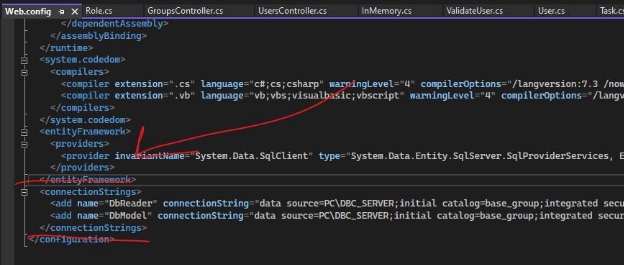
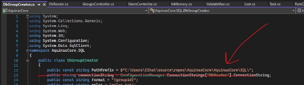

1. Клонировать репозиторий. 
1. Восстановить project.bak на свой SQL Server. 
1. AquinasCore/Views/web.config → поменять connection strings 

4. AquinasCore/SQL/DbGroupCreator.cs поменять адрес папки тут и в классе DbGroupDeletor в этом же файле ниже. 

5. Сделать импорт Postman коллекции из DBPRJ.postman\_collection.json 

6. Запустить сервер. 
6. Зарегистрировать новых юзеров. Их пароль хешируется, поэтому его стоит запомнить.  
6. Во всех запросах в заголовке Authorization нужно прописать username;password пользователя, под которым будут выполняться действия. 

9. Тестировать! 
